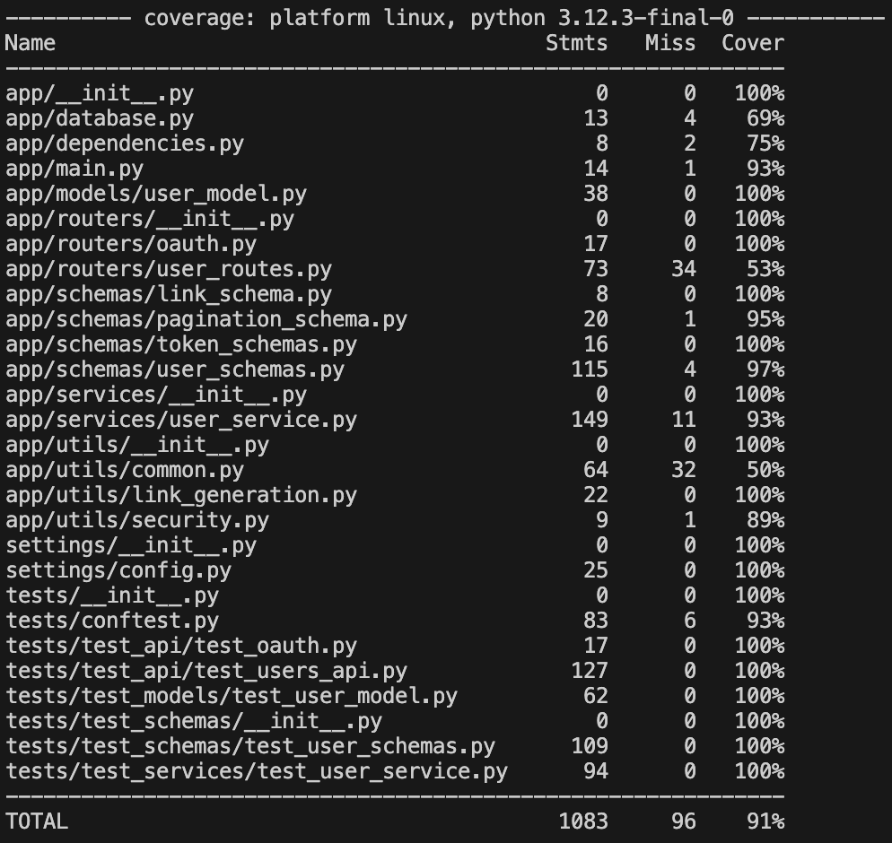
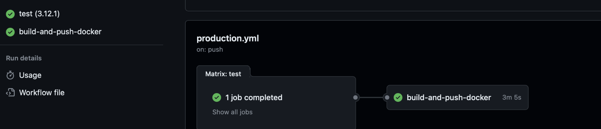

# Homework 10
## Event Manager Company: Software QA Analyst/Developer Onboarding Assignment
 

> NOTE: Each Issue has a link to the `Closed Issue` (with documentation), `Pull Request` (with documentation), and `Code Changes` (with test code).

### Summary of Issues:

### Closed Issues
1. API response for `Get User` contains null values for several attributes
> [Closed Issue #1](https://github.com/fcamacho3/event_manager_practice/issues/3)

> Pull Request: [Updated `UserResponse` model for `get_user`](https://github.com/fcamacho3/event_manager_practice/pull/4)

> [Code Changes for issue #1](https://github.com/fcamacho3/event_manager_practice/pull/4/files)
 

2. Username Validation in API Schema is not Normalized
> [Closed Issue #2](https://github.com/fcamacho3/event_manager_practice/issues/5)

> Pull Request: [Normalized `username` and enhanced parameters.](https://github.com/fcamacho3/event_manager_practice/pull/6)

> [Code Changes for issue #2](https://github.com/fcamacho3/event_manager_practice/pull/6/files)
 

3. Password Validation in API Schema Lacks Space Restriction and Defined Length and Character Requirements
> [Closed Issue #3](https://github.com/fcamacho3/event_manager_practice/issues/7)

> Pull Request: [Enhanced Password Validation Rules for User Registration](https://github.com/fcamacho3/event_manager_practice/pull/8)

> [Code Changes for issue #3](https://github.com/fcamacho3/event_manager_practice/pull/8/files)
 

4. User Registration Error: Incorrect Handling of Username and Email Uniqueness Checks
> [Closed Issue #4](https://github.com/fcamacho3/event_manager_practice/issues/9)

> Pull Request: [Updated `UserResponse` model for `register`](https://github.com/fcamacho3/event_manager_practice/pull/10)

> [Code Changes for issue #4](https://github.com/fcamacho3/event_manager_practice/pull/10/files)
 

5. Validation Issues with Skip and Limit Parameters in `List Users` Endpoint
> [Closed Issue #5](https://github.com/fcamacho3/event_manager_practice/issues/11)

> Pull Request: [Refined Pagination with Enhanced Skip and Limit Validation for `List Users` endpoint](https://github.com/fcamacho3/event_manager_practice/pull/12)

> [Code Changes for issue #5](https://github.com/fcamacho3/event_manager_practice/pull/12/files)
 

6. Email Validation in API Schema is not Normalized
> [Closed Issue #6](https://github.com/fcamacho3/event_manager_practice/issues/13)

> Pull Request: [Normalized and validated `email` input at `Register` endpoint](https://github.com/fcamacho3/event_manager_practice/pull/14)

> [Code Changes for issue #6](https://github.com/fcamacho3/event_manager_practice/pull/14/files)
 

## Lecture Issue
> Closed Issue: [Lecture Video Issue - Inconsistent User Profile Data Handling Between Request Body and API Schema](https://github.com/fcamacho3/event_manager_practice/issues/1)

> Pull Request: [Enhance URL Validation and Extend Tests for UserBase Model](https://github.com/fcamacho3/event_manager_practice/pull/2)

> Link to [Code Changes](https://github.com/fcamacho3/event_manager_practice/pull/2/files)
 

## Reflective Summary
Reflecting on my role as a software QA analyst for the class assignment, I realized the critical importance of detail and thoroughness. Navigating the codebase was like detective work, aiming to uncover and resolve hidden issues. This hands-on approach enriched my technical skills, particularly in understanding API failures and the necessity of robust testing. The assignment sharpened my abilities to read complex documentation and troubleshoot code, which are essential skills in any tech role.

The project also highlighted the importance of proficiency with tools and individual initiative in the tech world. Using GitHub, I managed various tasks such as forking repositories, enabling issues, creating branches, syncing updates, making and committing fixes, and merging changes. This shift towards more autonomous management of my contributions required effective use of commit messages and issue tracking for clear communication. While working independently, these tools were crucial for maintaining alignment with my peers, underlining the need for effective remote collaboration infrastructure.

Overall, this project extended beyond mastering software QA technicalities; it provided insights into effective teamwork in a tech environment. Future assignments could benefit from incorporating structured peer reviews and cross-functional tasks to better prepare us for real-world challenges, enhancing both technical and collaborative skills.
 

## Coverage Report

## GitHub Actions

## Grading Rubric

| Criteria                                                                                                                | Points |
|-------------------------------------------------------------------------------------------------------------------------|--------|
| Resolved 5 issues related to username validation, password validation, and profile field edge cases                      | 30     |
| Resolved the issue demonstrated in the instructor video                                                                 | 20     |
| Increased test coverage to 90% by writing comprehensive test cases                                                      | 20     |
| Followed collaborative development practices using Git and GitHub (branching, pull requests, code reviews)              | 15     |
| Submitted a well-organized GitHub repository with clear documentation, links to closed issues, and a reflective summary | 15     |
| **Total**                                                                                                               | **100**|
