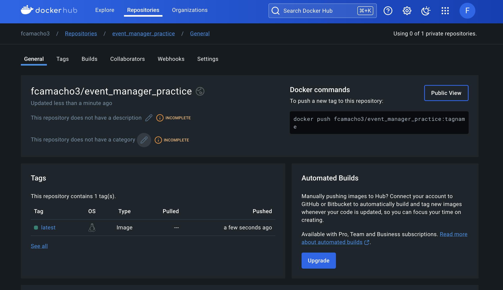

# Homework 10
## Event Manager Company: Software QA Analyst/Developer Onboarding Assignment
 

> NOTE: Each Issue has a link to the `Closed Issue` (with documentation), `Pull Request` (with documentation), and `Code Changes` (with test code).

### Summary of Issues:

### Closed Issues
1. API response for `Get User` contains null values for several attributes
> [Closed Issue #1](https://github.com/fcamacho3/event_manager_practice/issues/3)

> Pull Request: [Updated `UserResponse` model for `get_user`](https://github.com/fcamacho3/event_manager_practice/pull/4)

> [Code Changes for issue #1](https://github.com/fcamacho3/event_manager_practice/pull/4/files)
 

2. Username Validation in API Schema is not Normalized
> [Closed Issue #2](https://github.com/fcamacho3/event_manager_practice/issues/5)

> Pull Request: [Normalized `username` and enhanced parameters.](https://github.com/fcamacho3/event_manager_practice/pull/6)

> [Code Changes for issue #2](https://github.com/fcamacho3/event_manager_practice/pull/6/files)
 

3. Password Validation in API Schema Lacks Space Restriction and Defined Length and Character Requirements
> [Closed Issue #3](https://github.com/fcamacho3/event_manager_practice/issues/7)

> Pull Request: [Enhanced Password Validation Rules for User Registration](https://github.com/fcamacho3/event_manager_practice/pull/8)

> [Code Changes for issue #3](https://github.com/fcamacho3/event_manager_practice/pull/8/files)
 

4. User Registration Error: Incorrect Handling of Username and Email Uniqueness Checks
> [Closed Issue #4](https://github.com/fcamacho3/event_manager_practice/issues/9)

> Pull Request: [Updated `UserResponse` model for `register`](https://github.com/fcamacho3/event_manager_practice/pull/10)

> [Code Changes for issue #4](https://github.com/fcamacho3/event_manager_practice/pull/10/files)
 

5. Validation Issues with Skip and Limit Parameters in `List Users` Endpoint
> [Closed Issue #5](https://github.com/fcamacho3/event_manager_practice/issues/11)

> Pull Request: [Refined Pagination with Enhanced Skip and Limit Validation for `List Users` endpoint](https://github.com/fcamacho3/event_manager_practice/pull/12)

> [Code Changes for issue #5](https://github.com/fcamacho3/event_manager_practice/pull/12/files)
 

6. Email Validation in API Schema is not Normalized
> [Closed Issue #6](https://github.com/fcamacho3/event_manager_practice/issues/13)

> Pull Request: [Normalized and validated `email` input at `Register` endpoint](https://github.com/fcamacho3/event_manager_practice/pull/14)

> [Code Changes for issue #6](https://github.com/fcamacho3/event_manager_practice/pull/14/files)
 

## Lecture Issue
> Closed Issue: [Lecture Video Issue - Inconsistent User Profile Data Handling Between Request Body and API Schema](https://github.com/fcamacho3/event_manager_practice/issues/1)

> Pull Request: [Enhance URL Validation and Extend Tests for UserBase Model](https://github.com/fcamacho3/event_manager_practice/pull/2)

> Link to [Code Changes](https://github.com/fcamacho3/event_manager_practice/pull/2/files)
 

## Reflective Summary

Working on the Event Manager project provided a profound opportunity to enhance both my technical skills and collaborative processes. One of the key technical skills I developed was containerization using Docker. Setting up the Dockerfile and docker-compose.yml for the project improved my understanding of how to create reproducible development environments, manage dependencies, and ensure consistency across different development setups. Additionally, I gained valuable experience with FastAPI, learning how to structure a scalable web application, implement CRUD operations, and integrate with a PostgreSQL database. The process of writing and running tests using pytest and httpx emphasized the importance of automated testing in maintaining code quality and reliability.

Collaboratively, the project underscored the importance of clear communication and effective use of version control systems like GitHub. Coordinating with team members through pull requests and issues, I realized the critical role of detailed commit messages and thorough code reviews in maintaining project integrity. One of the significant challenges was ensuring that all team members were aligned on the project’s goals and code standards, which we addressed through regular meetings and detailed documentation. This experience taught me the value of combining individual initiative with collaborative effort, highlighting that successful software development is as much about people and processes as it is about code.

Overall, this assignment was instrumental in solidifying my technical and collaborative skills. The hands-on experience with Docker, FastAPI, and automated testing equipped me with practical skills directly applicable to real-world projects. The collaborative aspect reinforced the need for clear communication, detailed documentation, and effective use of version control systems. These insights will undoubtedly influence how I approach future projects, both technically and collaboratively.
 

## Coverage Report

## Dockerhub

## GitHub Actions

## Grading Rubric

| Criteria                                                                                                                | Points |
|-------------------------------------------------------------------------------------------------------------------------|--------|
| Resolved 5 issues related to username validation, password validation, and profile field edge cases                      | 30     |
| Resolved the issue demonstrated in the instructor video                                                                 | 20     |
| Increased test coverage to 90% by writing comprehensive test cases                                                      | 20     |
| Followed collaborative development practices using Git and GitHub (branching, pull requests, code reviews)              | 15     |
| Submitted a well-organized GitHub repository with clear documentation, links to closed issues, and a reflective summary | 15     |
| **Total**                                                                                                               | **100**|
